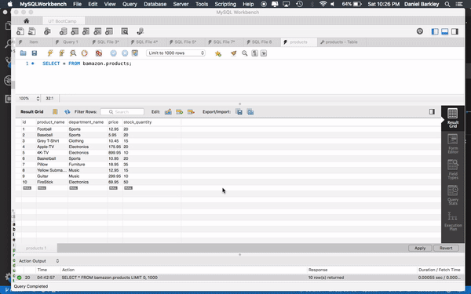

# Node.JS-MySQL

This CLI APP is an Amazon-like storefront using MySQL and node.js. The app will take in orders from customers and deplete stock from the store's inventory.

## Instructions

### 1. Type the following command into your terminal/bash: `node bamazonCustomer.js`

- This is the Customer Portal. This takes you through the following prompts to see products, order, and gives you the final amount while updating the quantity in the database. 

## Example:

### 2. Type the following command into your terminal/bash: `node bamazonManager.js`

- This is the Managers Portal. This takes you through the following prompts to see all products, see low inventory products, update inventory, and add new products to your database. 

## Example: